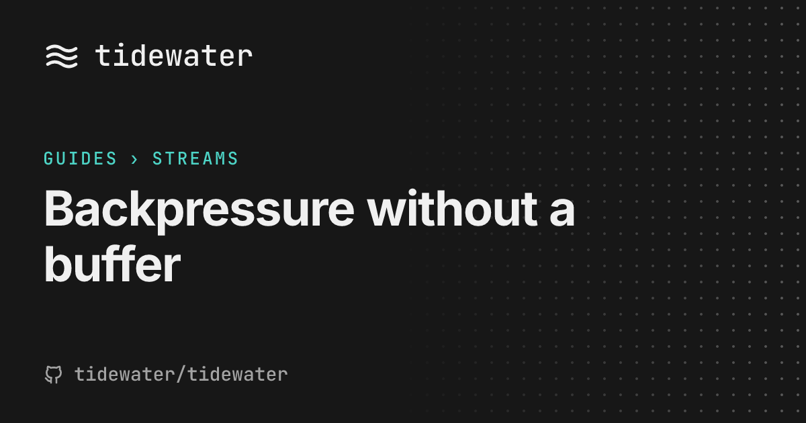
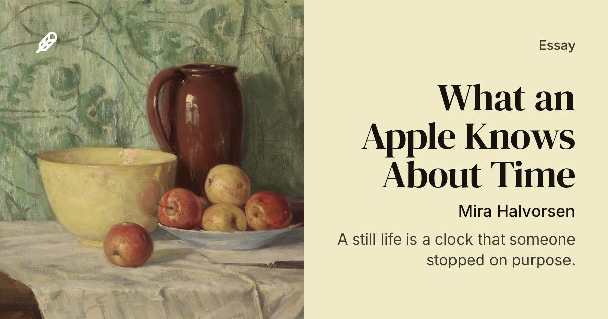
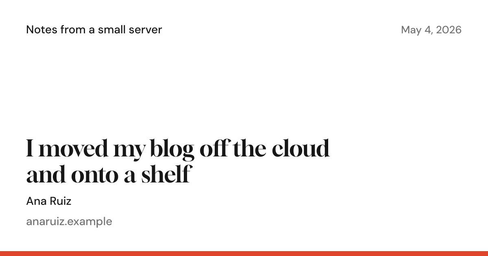
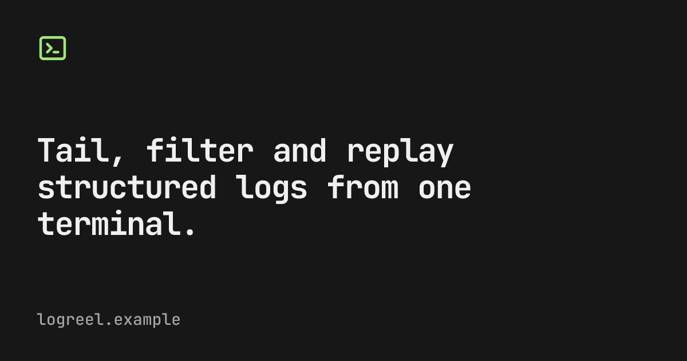
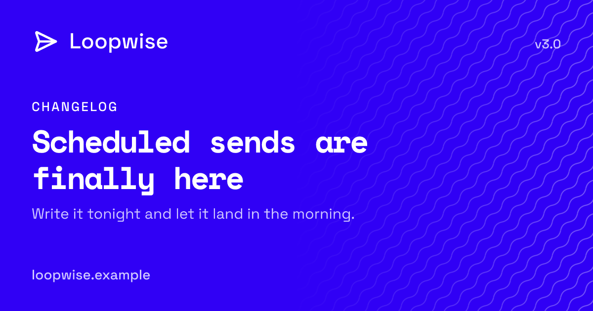
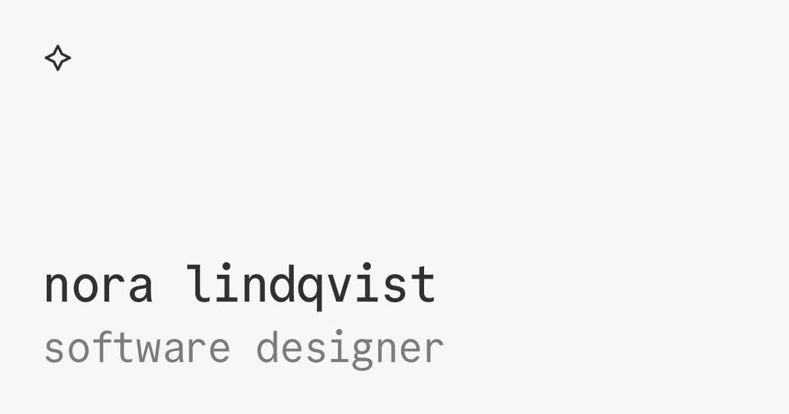
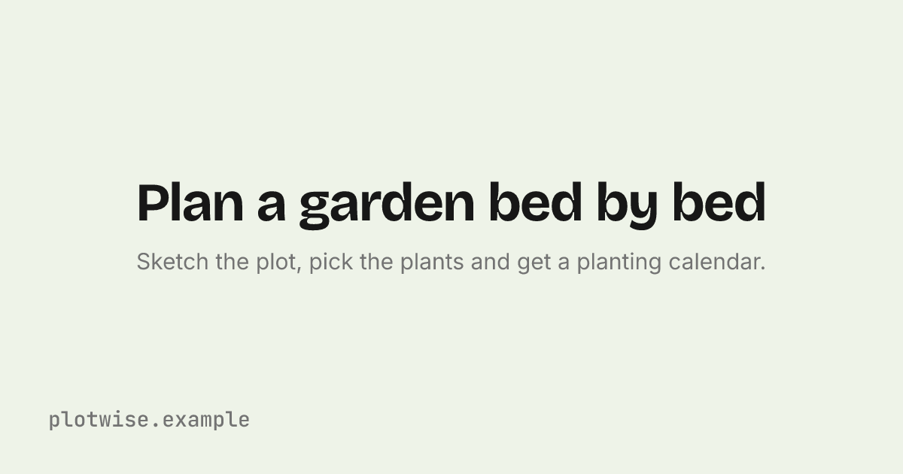
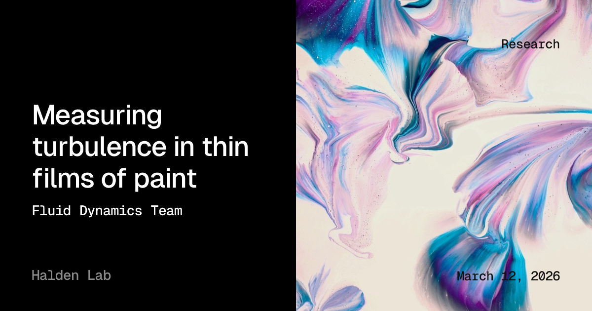

# Ogier

[](https://codecov.io/gh/macieklamberski/ogier)
[](https://www.npmjs.com/package/ogier)
[](https://github.com/macieklamberski/ogier/blob/main/LICENSE)

Easily generate Open Graph images from text, icons and fonts, with ready-made layouts and themes, and adapters for your site framework.

A share card is rendered from a plain card object through a layout, a theme and a size table. Satori turns the layout into SVG and resvg turns that into a 1200 by 630 PNG. Fonts come from fontsource packages, icons from any SVG file, your own or one shipped by an icon package (e.g. Tabler, Lucide). A VitePress adapter renders one card per page at build time and emits the tags that point at it.

## Installation

```bash
npm install ogier
```

## Quick Start

```typescript
import { writeFile } from 'node:fs/promises'
import { renderPng } from 'ogier'

const png = await renderPng({
  header: { text: 'feedsmith', icon: { file: './public/favicon.svg' } },
  eyebrow: 'Guides › Parsing',
  title: 'Parsing namespaces',
  footer: { text: 'macieklamberski/feedsmith', icon: { file: '@tabler/icons/outline/brand-github.svg' } },
})

await writeFile('og/guides-parsing.png', png)
```

## Examples

Each card below is rendered from a preset in [examples](examples). Click a card to see its source.

| | |
|---|---|
| [](examples/presets/docs.ts) | [](examples/presets/bookclub.ts) |
| [](examples/presets/editorial.ts) | [](examples/presets/post.ts) |
| [](examples/presets/wordmark.ts) | [](examples/presets/cover.ts) |
| [](examples/presets/launch.ts) | [](examples/presets/personal.ts) |
| [](examples/presets/centered.ts) | [](examples/presets/research.ts) |

## API

### `renderPng(card, style?)` and `renderSvg(card, style?)`

Render one card. Both take the same arguments and return a PNG buffer or an SVG string.

A card is what the image says and shows. It needs a title, a description or both. A description alone takes the title's place, which is what a home page card usually wants. The header and the footer are a line with a text, an icon, or both, plus an aside at the far end of the line: a date on a post, a version on a docs page. An icon alone makes a wordmark line. Each text on the line runs to half the card and then wraps, the header line downward and the footer line upward. The byline sits under the title: an author, a source, anything that is not the description.

The image covers half the card from edge to edge, the right half unless `position` says `'left'`, and the text moves to the other half. The header and footer lines still run the full width of the card, over the image, with the aside on the baseline of the text beside it. `align` sets the eyebrow, title, byline and description to the left, center or right. The header and footer lines keep their order whatever the alignment, with the icon and text first and the aside at the far end.

```typescript
type Card = {
  header?: { text?: string; icon?: IconRef; aside?: string }
  eyebrow?: string
  title?: string
  byline?: string
  description?: string
  footer?: { text?: string; icon?: IconRef; aside?: string }
  image?: ImageRef & { position?: 'left' | 'right' }
  align?: 'left' | 'center' | 'right'
}
```

An icon or an image is `{ file }` with a path, a file URL or a package path such as `'@tabler/icons/outline/brand-github.svg'` or `'lucide-static/icons/rss.svg'`, or `{ svg }` with the markup as a string or bytes. An image file can also be a PNG, JPG or WebP. A package path resolves from your node_modules, so any icon package that ships SVG files works once installed. `currentColor` in the SVG takes the color of the text beside it, or the icon's own `color` when given, and baked colors stay as they are.

Style is how the card is drawn. Every field is optional. The header sits top left, the eyebrow, title, byline and description in the middle, the footer bottom left, and the dot rail on the right when the background asks for it. Themes come from `ogier/themes`, `dark` and `light`.

| Option | Default | What it does |
|---|---|---|
| `theme` | `dark` from `ogier/themes` | Colors: `bg`, `text`, `muted`, `accent`, `pattern`, plus an optional color per text: `header`, `eyebrow`, `title`, `byline`, `description`, `footer` and `aside`. A text without its own color takes `text`, `accent` for the eyebrow, or `muted` for the description, the footer and the aside. Spread a preset to override one value. |
| `sizes` | the default table | Overrides merged over the defaults. `cardWidth` and `cardHeight` set the card size, `cardPadding` the frame as `{ top, right, bottom, left }` in pixels with a missing side at the edge, `contentWidth` the widest the headline gets, `slotLineHeight` the line height of the header and footer texts, `asideBaseline` the label font's ascender plus descender over its em size, which puts the aside on the text baseline, 0.73 by default, the `title*` keys the type scale, weights and tracking, the `*Tracking` keys the letter spacing of the header, eyebrow, byline, description, footer and aside, `headlinePosition: 'bottom'` moves the headline down against the footer, and `barHeight` draws an accent bar along the bottom edge. |
| `fonts` | `{ title: 'inter', body: 'inter', label: 'jetbrains-mono' }` | A fontsource slug per role: `title` for the title, `body` for the description, `label` for the header, eyebrow, byline, aside and footer. A description alone takes the title font. Inter and JetBrains Mono ship with ogier. Any other family needs its `@fontsource/<slug>` package installed in your project. |
| `background` | none | `{ pattern: 'dots' }` for the dot rail, or `{ image }` for a full-bleed image. |

```typescript
import { renderPng } from 'ogier'
import { light } from 'ogier/themes'

await renderPng(card, {
  theme: { ...light, accent: '#a2e57b' },
  sizes: { titleText: 80 },
  fonts: { title: 'roboto' },
  background: { image: { file: './og-bg.png' } },
})
```

### `createRenderer(style?)`

Render many cards with one style. The fonts are read from disk on the first render and shared by every render after it, so a server renders a card per request and a build renders a card per page without reading the font files each time. Icons and images are read per render.

```typescript
import { createRenderer } from 'ogier'

const renderer = createRenderer({ theme: light, background: { pattern: 'dots' } })

for (const page of pages) {
  await writeFile(`og/${page.slug}.png`, await renderer.renderPng(page.card))
}
```

`renderPng(card, style?)` and `renderSvg(card, style?)` are one render through a fresh renderer. The VitePress adapter renders every page through one.

### `composeMetadata(input)` and `composeMetaTags(metadata)`

`composeMetadata` builds the Open Graph values for one page. `composeMetaTags` turns them into `['meta', attributes]` pairs, with the title, description and image mirrored into the Twitter tags.

```typescript
import { getImageUrl, composeMetadata, composeMetaTags } from 'ogier'

const metadata = composeMetadata({
  url: 'https://feedsmith.dev/guides/parsing',
  title: 'Parsing namespaces',
  description: 'How the parser reads namespaces.',
  image: getImageUrl('https://feedsmith.dev', 'guides/parsing'),
})

const tags = composeMetaTags(metadata)
```

`getImageUrl(hostname, path, dir?)` is the default image scheme: the page path with slashes turned into dashes, as a PNG under `og/`.

## Adapters

### VitePress

```typescript
// docs/.vitepress/config.ts
import { dark } from 'ogier/themes'
import { vitepress } from 'ogier/vitepress'
import { defineConfig } from 'vitepress'

const og = vitepress({
  site: { hostname: 'https://feedsmith.dev', favicon: { file: 'docs/public/favicon.svg' } },
  card: {
    header: { text: 'feedsmith', icon: { file: 'docs/public/favicon.svg' } },
    footer: { text: 'macieklamberski/feedsmith', icon: { file: '@tabler/icons/outline/brand-github.svg' } },
  },
  style: {
    theme: { ...dark, accent: '#ff8c4d' },
    background: { pattern: 'dots' },
  },
})

export default defineConfig({
  transformHead: og.transformHead,
  buildEnd: og.buildEnd,
})
```

Each page gets the tags from `transformHead` and a PNG under `og/` from `buildEnd`. The eyebrow is the sidebar trail to the page, the title is the page title with any `Prefix:` removed, and the home page shows the site description.

| Option | What it holds |
|---|---|
| `site` | `hostname`, plus `imageDir` for the folder under the output dir and in the image URL, default `og`, and `imageUrl`, a function from the page path to the image URL, default `getImageUrl`. `favicon` takes an SVG as `{ file }` or `{ svg }` and writes it as `favicon.png` at the output root, 192 px square unless `size` says otherwise, with an icon link on every page. Search engines take PNG favicons and not SVG ones. |
| `card` | The fields every card shares, merged over the page defaults. A function of the page data and site data gives per-page values. |
| `style` | The style passed to every render. |
